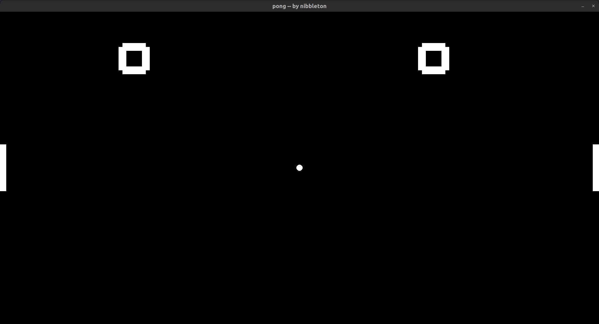
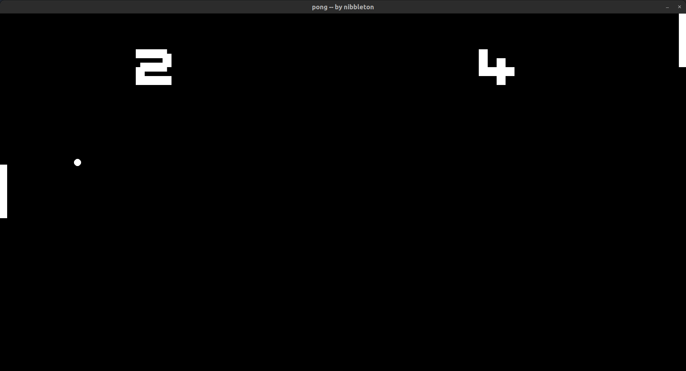
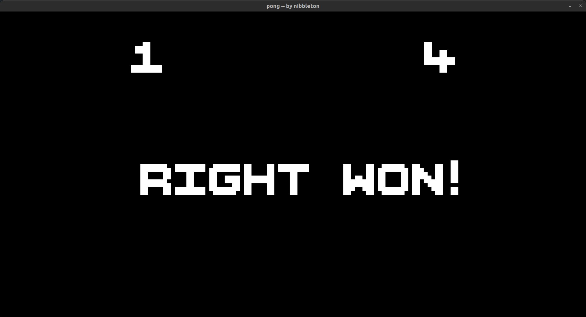

# 🕹️ Pong

A modern remake of the classic **Pong**, built with **Python** and **Pygame**.  
Fast-paced. Minimalist. Addictively simple.

---

## 📸 Gameplay Screenshots




---

## 🎮 How to Play
- **Left Player:** W / S  
- **Right Player:** ↑ / ↓  
- First to **5 points** wins.

---

## ⚙️ Run It
```bash
pip install pygame
python main.py
```

## 🧠 About

A minimalist remake of Pong — built to explore the core ideas behind classic game design:  
motion, collision, and control.  

No engines. No shortcuts. Just pure Python logic.  
Made by **nibbleton** — cs grad × math propagandist.
